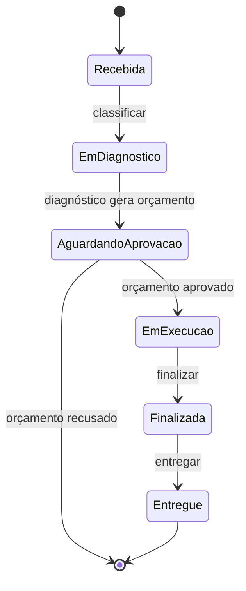
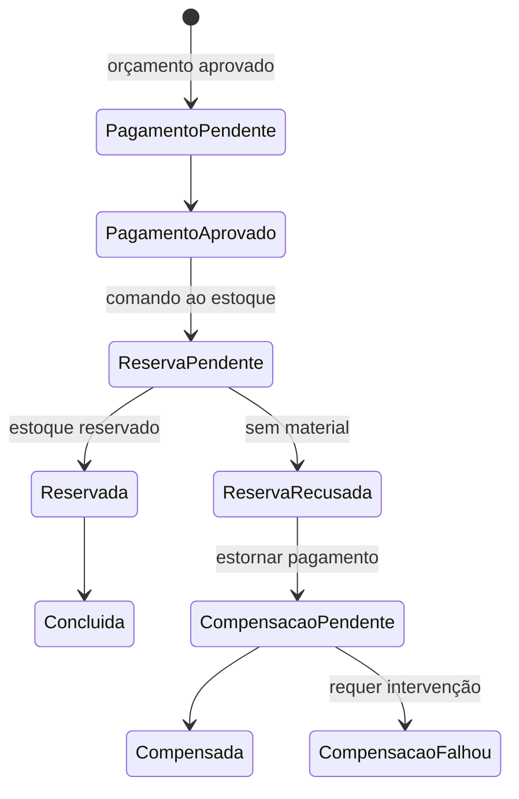
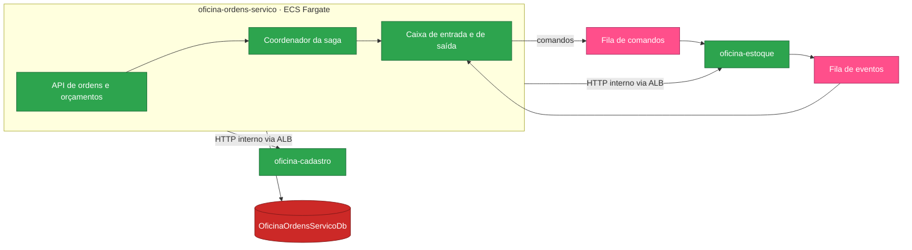

# oficina-ordens-servico

Microsserviço de **ordens de serviço, orçamento e saga de pagamento** da solução **Oficina**. É também o **hub de execução local** e o repositório da **validação de ponta a ponta**.


---

## Sumário

- [Visão geral](#visão-geral)
- [Ordem de deploy da solução](#ordem-de-deploy-da-solução)
- [Arquitetura](#arquitetura)
- [Autenticação](#autenticação)
- [Endpoints](#endpoints)
- [Pagamentos](#pagamentos)
- [O que consome e o que publica](#o-que-consome-e-o-que-publica)
- [Configuração](#configuração)
- [Como executar](#como-executar)
- [Validação](#validação)
- [Execução local](#execução-local)
- [Limitações conhecidas](#limitações-conhecidas)
- [Próxima etapa](#próxima-etapa)

---

## Visão geral

A **Oficina** é uma plataforma de gestão de oficina mecânica implantada na AWS e distribuída em **6 repositórios** que compõem um único sistema. O cliente acessa uma **API Gateway HTTP**, que autentica na borda por uma **Lambda authorizer** e encaminha o tráfego, via **VPC Link**, para um **ALB interno** que roteia para três microsserviços **.NET 10 em ECS Fargate**. Os serviços se comunicam por HTTP interno e por filas **SQS FIFO**, e persistem em um **RDS SQL Server** compartilhado.

| Repositório | Responsabilidade | Etapas |
|---|---|:---:|
| [oficina-infra-db](https://github.com/fabianorodrigues/oficina-infra-db-fiap-fase4) | Rede, banco de dados, segredos e estado do Terraform | 1 e 3 |
| [oficina-infra](https://github.com/fabianorodrigues/oficina-infra-fiap-fase4) | Plataforma ECS/ALB e entrada de API | 2, 6 e 7 |
| [oficina-auth-lambda](https://github.com/fabianorodrigues/oficina-auth-lambda-fiap-fase4) | Autenticação por CPF e validação de token | 4 |
| [oficina-cadastro](https://github.com/fabianorodrigues/oficina-cadastro-fiap-fase4) | Clientes, veículos, funcionários e catálogo de serviços | 5 |
| [oficina-estoque](https://github.com/fabianorodrigues/oficina-estoque-fiap-fase4) | Peças, insumos, saldos e reservas | 5 |
| **oficina-ordens-servico** *(este)* | Ordens de serviço, orçamento e saga de pagamento | 5 e 8 |

**Papel deste repositório:** orquestra o ciclo de vida da ordem de serviço e é o único serviço que coordena os demais — abertura, diagnóstico, orçamento, **saga distribuída** de pagamento e reserva de material, e relatórios.

---

## Ordem de deploy da solução

| # | Repositório | Workflow | Confirmação |
|:---:|---|---|:---:|
| 1 | oficina-infra-db | Database Infrastructure Deploy | `APPLY` |
| 2 | oficina-infra | Platform Deploy | `APPLY` |
| 3 | oficina-infra-db | Database Bootstrap | `BOOTSTRAP` |
| 4 | oficina-auth-lambda | Auth Deploy | `DEPLOY` |
| **5** | cadastro · estoque · **oficina-ordens-servico** | **Deploy** | `DEPLOY` |
| 6 | oficina-infra | Entrypoint Deploy | `APPLY` |
| 7 | oficina-infra | Observability Validate | — |
| **8** | **oficina-ordens-servico** | **AWS E2E Validate** | `VALIDATE` |

> [!IMPORTANT]
> Este repositório aparece na **etapa 5**, junto aos outros dois serviços, e **encerra a sequência na etapa 8** com a validação funcional de ponta a ponta. É também o **hub de execução local**: seu arquivo de composição sobe os três serviços, o banco e as filas emuladas.

---

## Arquitetura

O ciclo de vida da ordem de serviço:



A aprovação do orçamento dispara a **saga**, que trata pagamento e reserva de material como uma transação distribuída com compensação:



O serviço fala com os demais de duas formas — HTTP interno (via ALB) para consultas e SQS FIFO para a saga:



Clean Architecture com portas na camada de aplicação e adaptadores na infraestrutura: clientes HTTP tipados, mensageria e o processador de pagamento implementam interfaces definidas pelos casos de uso.

---

## Autenticação

O token é validado pelo autorizador da API Gateway, que devolve as *claims* à borda. A API Gateway as converte em cabeçalhos de identidade (`x-oficina-user-id`, `x-oficina-user-cpf`, `x-oficina-user-role`, `x-oficina-user-name`) e os injeta na requisição encaminhada. Apenas `/health`, `/ready` e as ações externas de orçamento por token são anônimas.

Dois pontos específicos deste serviço:

- **Propagação entre serviços.** As chamadas às rotas internas de cadastro e estoque repassam os cabeçalhos de identidade recebidos, de modo que o serviço chamado autoriza em nome do mesmo usuário.
- **Escopo do cliente.** As rotas de cliente derivam o solicitante da *claim* de identidade e verificam a propriedade do recurso. Ordem ou orçamento de outro cliente responde como inexistente.

Os cabeçalhos são confiáveis porque o ALB é interno e o acesso está restrito ao VPC Link. No perfil de desenvolvimento, um modo alternativo aceita cabeçalhos `X-Dev-*` — **ativado apenas em desenvolvimento**.

---

## Endpoints

| Método | Rota | Perfil |
|---|---|---|
| `POST` `GET` | `/api/ordens-servico` · `/{id}` · `/{id}/status` | Funcionário ou administrador |
| `POST` | `/api/ordens-servico/{id}/classificar` · `/diagnostico` · `/finalizar` · `/entregar` | Funcionário ou administrador |
| `GET` `POST` | `/api/orcamentos/{id}` · `/aprovar` · `/recusar` | Funcionário ou administrador |
| `GET` `POST` | `/api/meus-orcamentos/...` · `/api/minhas-ordens-servico/...` | Cliente |
| `GET` | `/api/orcamentos/acoes-externas/aprovar` · `/recusar` | Anônimo, por token de uso único |
| `GET` | `/api/relatorios/tempo-medio-execucao` | Funcionário ou administrador |
| `POST` | `/api/webhooks/payments` | **Desativado, responde não encontrado** |
| `GET` | `/health` · `/ready` | Anônimo |

As ações externas de orçamento permitem que o cliente aprove ou recuse por link, sem autenticar: o token é validado e distingue link inválido, expirado e ação já processada.

> [!NOTE]
> `/ready` neste serviço responde de forma estática e **não verifica a conexão com o banco**.

---

## Pagamentos

O provedor de pagamento é **um mock interno determinístico**, não uma integração externa:

- O resultado é decidido pelo cenário configurado, fixado em aprovação no ambiente publicado.
- A integração externa está **estruturalmente desativada**: a validação de inicialização interrompe a aplicação se alguém tentar habilitá-la, e o webhook responde não encontrado.
- O deploy confere os sinalizadores de pagamento e falha se qualquer um deles estiver ligado.

A saga, a idempotência e a compensação são reais e exercitadas; apenas o provedor é simulado.

---

## O que consome e o que publica

### Consome

| Valor | Origem | Criado por |
|---|---|---|
| Cluster, grupo de segurança e subnets das tasks | `/oficina/infra/cluster/name` · `/oficina/infra/ecs/task-security-group-id` · `/oficina/infra/subnets/private/{1,2}` | oficina-infra |
| Registro de imagem, target group e grupo de log | `/oficina/infra/ecr/ordens` · `/oficina/infra/ecs/ordens/{target-group-arn,log-group-name}` | oficina-infra |
| Filas de comandos e eventos + DLQs | `/oficina/infra/sqs/{estoque-comandos,ordens-eventos}[-dlq]/url` | oficina-infra |
| DNS do ALB interno | `/oficina/infra/alb/dns-name` | oficina-infra |
| Credenciais de runtime e migração | `/oficina/ordens/{runtime,migration}-db` | oficina-infra-db |

As integrações com cadastro e estoque apontam para o **DNS do ALB interno**; as credenciais são injetadas como **ECS secrets**.

### Publica

O serviço ECS Fargate no *target group* do ALB, os comandos de reserva nas filas e o esquema do banco de ordens, aplicado por uma task de migração.

---

## Configuração

Configure em **Settings → Secrets and variables → Actions** do repositório.

| Tipo | Nome | Uso | Obrigatório |
|---|---|---|:---:|
| Secret | `AWS_ACCESS_KEY_ID` · `AWS_SECRET_ACCESS_KEY` · `AWS_SESSION_TOKEN` | Credenciais temporárias da AWS | **Sim** |
| Variable | `AWS_REGION` | Região dos recursos | **Sim** |
| Variable | `ECS_TASK_EXECUTION_ROLE_ARN` | Role de execução das tasks ECS | **Sim** |
| Variable | `ECS_TASK_ROLE_ARN` | Role de aplicação das tasks ECS | **Sim** |

### Papéis IAM das tasks ECS — não provisionados automaticamente

O deploy registra *task definitions* Fargate e reutiliza duas roles IAM que **precisam existir antes da etapa 5**. Nenhum workflow da solução as cria.

| Variable | Trust | Permissões mínimas |
|---|---|---|
| `ECS_TASK_EXECUTION_ROLE_ARN` | `ecs-tasks.amazonaws.com` | `AmazonECSTaskExecutionRolePolicy` e `secretsmanager:GetSecretValue` nos segredos `/oficina/ordens/{runtime,migration}-db` |
| `ECS_TASK_ROLE_ARN` | `ecs-tasks.amazonaws.com` | Ações SQS nas filas de comandos e eventos: `sqs:ReceiveMessage`, `SendMessage`, `DeleteMessage`, `GetQueueAttributes` |

> [!NOTE]
> É o **mesmo par de roles** usado pelo bootstrap e pelos demais serviços. Crie uma vez e reutilize nos quatro repositórios que executam tasks ECS.

### Variáveis de ambiente da aplicação

Definidas pelo deploy na *task definition*; nenhuma precisa ser configurada no GitHub.

| Chave | Valor no ambiente publicado |
|---|---|
| `ConnectionStrings__DefaultConnection` | Injetada como ECS secret a partir do Secrets Manager |
| `Integrations__Cadastro__BaseUrl` · `Integrations__Estoque__BaseUrl` | DNS do ALB interno |
| `Messaging__Sqs__Enabled` · `DistributedFlow__Enabled` | **Ativados** |
| `Messaging__Sqs__*QueueUrl` | Os quatro endereços de fila |
| `Payments__UseMock` · `Payments__Mode` | **Mock** — integração externa desativada |
| `Database__ApplyMigrations` | Desativado — migrações rodam em task própria |

---

## Como executar

### Etapa 5 — Ordens Deploy

**Actions → Ordens Deploy → Run workflow → `confirmation` = `DEPLOY`**

Roda apenas na branch `main`. Sequência: valida a requisição, as variáveis e a integração de pagamentos → descobre cluster, registro de imagem, filas e DNS do ALB → confere que as filas são FIFO → compila e testa → constrói as imagens → varredura de vulnerabilidades → envia ao ECR → **executa a task de migração (ECS Run Task) e aguarda** → registra a *task definition* de runtime → **cria ou atualiza o serviço ECS** e aguarda ficar estável → confirma destino saudável no ALB.

### Etapa 8 — AWS E2E Validate

**Actions → AWS E2E Validate → Run workflow → `confirmation` = `VALIDATE`**

Executa o fluxo funcional contra o ambiente publicado: autentica, cadastra cliente e veículo, abre uma ordem, registra o diagnóstico, aprova o orçamento, acompanha a saga até a reserva de material e conclui a ordem. É a validação final da solução. Execute **apenas após a etapa 6**; antes disso as rotas ainda não existem.

---

## Validação

### Pelo Console AWS

| Serviço | O que verificar |
|---|---|
| **ECR** | Repositório de ordens com a imagem do commit publicado |
| **ECS → Serviços** | `oficina-ordens-servico` estável, com a task de runtime em execução |
| **SQS** | Fila de eventos sendo consumida e **DLQs vazias** |

### Pela AWS CLI

<details>
<summary>Comandos de validação</summary>

```bash
REGIAO=<sua-regiao>
CLUSTER=$(aws ssm get-parameter --name /oficina/infra/cluster/name \
  --region "$REGIAO" --query 'Parameter.Value' --output text)

aws ecs describe-services --cluster "$CLUSTER" --services oficina-ordens-servico \
  --region "$REGIAO" --query 'services[0].{Status:status,Rodando:runningCount}' --output table

# Após a etapa 6, verificação de saúde pela API pública
API=$(aws ssm get-parameter --name /oficina/infra/api/url \
  --region "$REGIAO" --query 'Parameter.Value' --output text)
curl -s -o /dev/null -w '%{http_code}\n' "$API/health/ordens"
```

</details>

---

## Execução local

Este repositório orquestra o **ambiente local completo da solução**: banco SQL Server, filas FIFO emuladas, um serviço de pagamento simulado e os três microsserviços, construídos a partir dos diretórios vizinhos.

**Pré-requisitos:** Docker, e os repositórios [oficina-cadastro](https://github.com/fabianorodrigues/oficina-cadastro-fiap-fase4) e [oficina-estoque](https://github.com/fabianorodrigues/oficina-estoque-fiap-fase4) clonados **lado a lado** com este.

```
pasta-de-trabalho/
├── oficina-cadastro-fiap-fase4/
├── oficina-estoque-fiap-fase4/
└── oficina-ordens-servico-fiap-fase4/   <- execute daqui
```

```bash
# 1. Gera o arquivo de ambiente com senhas locais
pwsh ./scripts/setup-local-env.ps1

# 2. Sobe banco, filas, pagamento simulado e os três serviços
pwsh ./scripts/start-local.ps1

# 3. Confere que tudo subiu
pwsh ./scripts/status-local.ps1

# 4. Valida as rotas e o fluxo de mensagens
pwsh ./scripts/smoke-local.ps1
pwsh ./scripts/smoke-sqs-local.ps1

# 5. Exercita a saga de ponta a ponta
pwsh ./scripts/run-saga-smoke-test.ps1

# Logs e encerramento
pwsh ./scripts/logs-local.ps1
pwsh ./scripts/stop-local.ps1     # reset-local.ps1 apaga também os volumes
```

### Testes

```bash
dotnet restore
dotnet build -c Release
dotnet test
```

A suíte de ponta a ponta é ignorada por padrão e só executa dentro do ambiente composto, por um perfil dedicado — portanto **não roda na integração contínua**.

---

## Limitações conhecidas

- **Pagamento simulado.** Não há integração com provedor externo; o caminho externo é bloqueado por validação de inicialização.
- **Réplica única, sem escala automática**, por decisão de projeto.
- **Testes de ponta a ponta fora da CI**, por dependerem do ambiente composto.
- **Compensação sem reprocessamento automático.** Uma saga que chega ao estado de falha de compensação exige intervenção manual.

---

## Próxima etapa

Este é o último repositório da sequência. Com a **etapa 8** concluída, a solução está publicada e validada de ponta a ponta.

Para revisar a plataforma ou reexecutar as validações, volte a **[oficina-infra](https://github.com/fabianorodrigues/oficina-infra-fiap-fase4)**.
