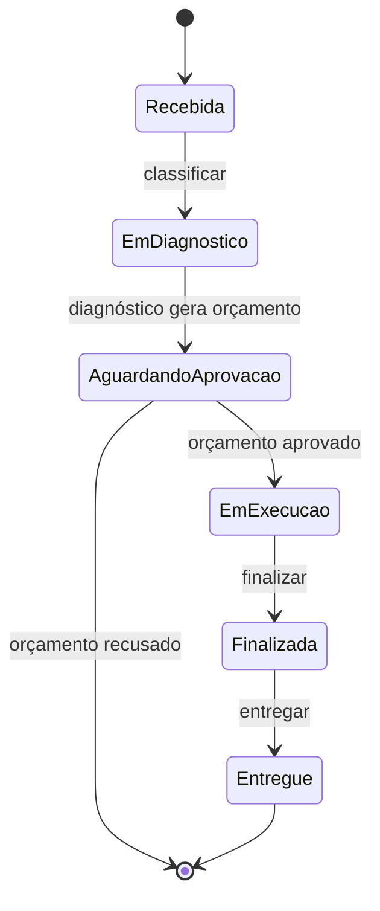
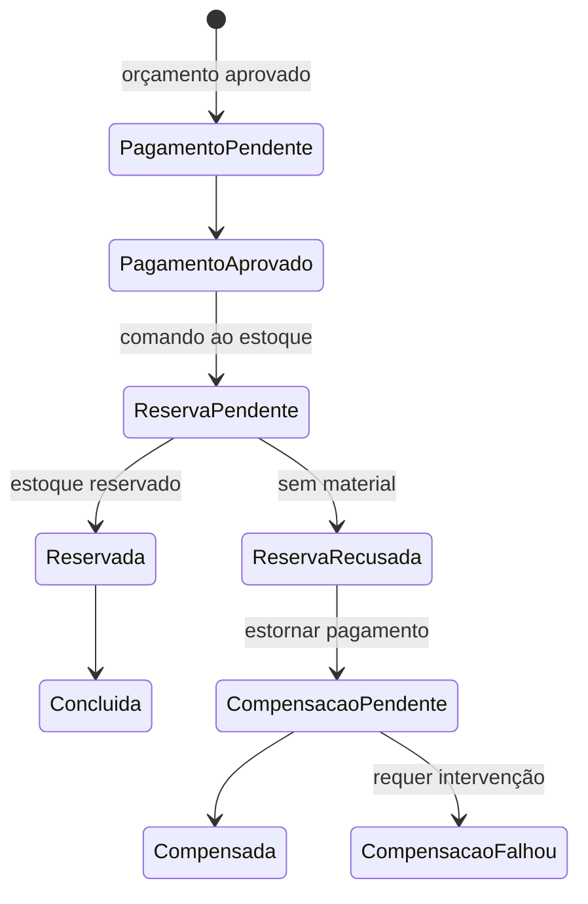
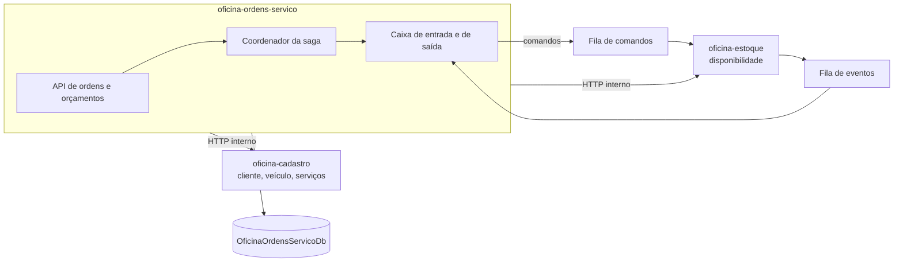

# oficina-ordens-servico

> Microsserviço de ordens de serviço, orçamento e saga de pagamento da Oficina.
> **.NET 10** · **ASP.NET Core** · **EF Core / SQL Server** · **SQS FIFO** · **EKS** · **Docker Compose**

---

## A solução

A **Oficina** é uma plataforma de gestão de oficina mecânica distribuída em **6 repositórios** que compõem um único sistema na AWS. O cliente acessa uma API Gateway que autentica na borda e encaminha o tráfego para três microsserviços .NET 10 em EKS, que se comunicam por HTTP e por filas SQS FIFO e persistem em um RDS SQL Server compartilhado.

| Repositório | Responsabilidade |
|---|---|
| [oficina-infra-db](https://github.com/fabianorodrigues/oficina-infra-db-fiap-fase4) | Rede, banco de dados, segredos e estado do Terraform |
| [oficina-infra](https://github.com/fabianorodrigues/oficina-infra-fiap-fase4) | Plataforma EKS e entrypoint de API |
| [oficina-auth-lambda](https://github.com/fabianorodrigues/oficina-auth-lambda-fiap-fase4) | Autenticação por CPF e emissão de token |
| [oficina-cadastro](https://github.com/fabianorodrigues/oficina-cadastro-fiap-fase4) | Clientes, veículos, funcionários e catálogo de serviços |
| [oficina-estoque](https://github.com/fabianorodrigues/oficina-estoque-fiap-fase4) | Peças, insumos, saldos e reservas |
| **oficina-ordens-servico** *(este)* | Ordens de serviço, orçamento e saga de pagamento |

---

## Ordem de deploy

| # | Repositório | Workflow | Confirmação |
|---|---|---|---|
| 1 | oficina-infra-db | Database Infrastructure Deploy | `APPLY` |
| 2 | oficina-infra | Platform Deploy | `APPLY` |
| 3 | oficina-infra-db | Database Bootstrap | `BOOTSTRAP` |
| 4 | oficina-auth-lambda | Auth Deploy | `DEPLOY` |
| **5** | cadastro · estoque · **oficina-ordens-servico** | **Deploy** | `DEPLOY` |
| 6 | oficina-infra | Entrypoint Deploy | `APPLY` |
| 7 | oficina-infra | Observability Validate | `VALIDATE` |
| **8** | **oficina-ordens-servico** | **AWS E2E Validate** | `VALIDATE` |

> Este repositório aparece na **etapa 5**, junto aos outros dois serviços, e **encerra a sequência na etapa 8** com a validação funcional de ponta a ponta.
>
> É também o **hub de execução local**: o arquivo de composição daqui sobe os três serviços, o banco e as filas emuladas.

---

## Responsabilidade

Orquestra o ciclo de vida da ordem de serviço e é o único serviço que coordena os demais:

- **Ordens de serviço** — abertura, classificação, diagnóstico, execução, finalização e entrega.
- **Orçamento** — geração a partir do diagnóstico, com aprovação ou recusa pelo funcionário ou pelo próprio cliente.
- **Saga distribuída** — coordena pagamento e reserva de material, com compensação quando a reserva é recusada.
- **Relatórios** — tempo médio de execução.



---

## Arquitetura

A aprovação do orçamento dispara a saga, que trata pagamento e reserva de material como uma transação distribuída com compensação.



O serviço fala com os demais de duas formas:



Clean Architecture com portas na camada de aplicação e adaptadores na infraestrutura: clientes HTTP tipados, mensageria e o processador de pagamento implementam interfaces definidas pelos casos de uso.

---

## Autenticação

O token é validado pelo autorizador da API Gateway, que devolve as claims à borda. A API Gateway as converte em cabeçalhos de identidade (`x-oficina-user-id`, `x-oficina-user-cpf`, `x-oficina-user-role`, `x-oficina-user-name`) e os injeta na requisição encaminhada.

Este serviço materializa esses cabeçalhos como claims e aplica as políticas de autorização por perfil. Requisição sem identidade válida é rejeitada pela política padrão; apenas `/health`, `/ready` e as ações externas de orçamento por token são anônimas.

Dois pontos específicos deste serviço:

- **Propagação entre serviços.** As chamadas às rotas internas de cadastro e estoque repassam os cabeçalhos de identidade recebidos, de modo que o serviço chamado autoriza em nome do mesmo usuário.
- **Escopo do cliente.** As rotas de cliente derivam o solicitante exclusivamente da claim de identidade e verificam a propriedade do recurso. Ordem ou orçamento de outro cliente responde como inexistente, para não revelar sua existência.

Os cabeçalhos são confiáveis porque o balanceador é interno e o acesso está restrito ao VPC Link — nenhum chamador externo alcança o serviço sem passar pela borda. Manter essa restrição é parte do modelo de segurança.

No perfil de desenvolvimento, um modo alternativo aceita cabeçalhos `X-Dev-*` para simular perfil e usuário sem token. Ele **só é ativado em desenvolvimento**.

---

## Endpoints

| Método | Rota | Perfil |
|---|---|---|
| `POST` `GET` | `/api/ordens-servico` | Funcionário ou administrador |
| `GET` | `/api/ordens-servico/{id}` · `/{id}/status` | Funcionário ou administrador |
| `POST` | `/api/ordens-servico/{id}/classificar` · `/diagnostico` | Funcionário ou administrador |
| `POST` | `/api/ordens-servico/{id}/finalizar` · `/entregar` | Funcionário ou administrador |
| `GET` | `/api/orcamentos/{id}` | Funcionário ou administrador |
| `POST` | `/api/orcamentos/{id}/aprovar` · `/recusar` | Funcionário ou administrador |
| `GET` `POST` | `/api/meus-orcamentos/...` | Cliente |
| `GET` | `/api/minhas-ordens-servico/...` | Cliente |
| `GET` | `/api/orcamentos/acoes-externas/aprovar` · `/recusar` | Anônimo, por token de uso único |
| `GET` | `/api/relatorios/tempo-medio-execucao` | Funcionário ou administrador |
| `POST` | `/api/webhooks/payments` | Anônimo — **desativado, responde não encontrado** |
| `GET` | `/health` · `/ready` | Anônimo |

As ações externas de orçamento permitem que o cliente aprove ou recuse por link, sem autenticar: o token é validado e distingue link inválido, expirado e ação já processada.

> `/ready` neste serviço responde de forma estática e **não verifica a conexão com o banco**.

---

## Pagamentos

O provedor de pagamento é **um mock interno determinístico**, não uma integração externa:

- O resultado é decidido pelo cenário configurado, fixado em aprovação no ambiente publicado.
- A integração externa está **estruturalmente desativada**: a validação de inicialização interrompe a aplicação se alguém tentar habilitá-la, e o webhook responde não encontrado.
- O deploy confere os sinalizadores no manifesto renderizado e falha se qualquer um deles estiver ligado.

Foi uma decisão de escopo: a saga, a idempotência e a compensação são reais e exercitadas; apenas o provedor é simulado.

---

## Contrato de integração

### Consome

| Valor | Origem | Criado por |
|---|---|---|
| Cluster e namespace | `/oficina/infra/cluster/{name,namespace}` | oficina-infra |
| Registro de imagem | `/oficina/infra/ecr/ordens` | oficina-infra |
| Filas de comandos e eventos | `/oficina/infra/sqs/...` (4 endereços) | oficina-infra |
| Credenciais de banco | `/oficina/ordens/{runtime,migration}-db` | oficina-infra-db |
| Rotas internas de cadastro e estoque | Serviços no cluster | cadastro, estoque |

### Publica

Rotas HTTP no cluster, os comandos de reserva nas filas, e o esquema do banco de ordens, aplicado pelo Job de migração.

---

## Configuração

Configure em **Settings → Secrets and variables → Actions** do repositório.

| Tipo | Nome | Obrigatório |
|---|---|---|
| Secret | `AWS_ACCESS_KEY_ID` · `AWS_SECRET_ACCESS_KEY` · `AWS_SESSION_TOKEN` | **Sim** |
| Variable | `AWS_REGION` | **Sim** |

Não há mais nada a configurar: cluster, registro de imagem, endereços das filas, credenciais e endereços dos serviços vizinhos vêm do que as etapas anteriores publicaram e do arquivo de configuração do repositório.

### Variáveis de ambiente da aplicação

| Chave | Valor no ambiente publicado |
|---|---|
| `ConnectionStrings__DefaultConnection` | Montada pelo CSI a partir do segredo |
| `Integrations__Cadastro__BaseUrl` · `Integrations__Estoque__BaseUrl` | Endereços internos no cluster |
| `Messaging__Sqs__Enabled` · `DistributedFlow__Enabled` | **Ativados** |
| `Messaging__Sqs__*QueueUrl` | Os quatro endereços de fila, obrigatórios fora de desenvolvimento |
| `Payments__UseMock` | **Ativado**, e obrigatório fora de desenvolvimento |
| `Database__ApplyMigrations` | Desativado — migrações rodam em Job próprio |

> **Atenção operacional:** os valores padrão do código deixam a mensageria e o fluxo distribuído **desativados**. Eles só são ligados pelo ConfigMap no cluster e pelo ambiente local. Executar a aplicação com `dotnet run` puro não exercita a saga.

---

## Executar pelo GitHub Actions

### Ordens Deploy — etapa 5

**Actions → Ordens Deploy → Run workflow → `confirmation` = `DEPLOY`**

Roda apenas na branch `main`. Sequência: valida a requisição, a configuração e a integração de pagamentos → descobre cluster, registro de imagem e filas → confere que as quatro filas são FIFO → compila e testa → constrói as imagens → varredura de vulnerabilidades, que interrompe o deploy em achado alto ou crítico → envia ao registro → renderiza os manifestos → **confere os sinalizadores de pagamento no manifesto** → aplica → executa o Job de migração e aguarda → aplica o Deployment → teste de fumaça.

### AWS E2E Validate — etapa 8

**Actions → AWS E2E Validate → Run workflow → `confirmation` = `VALIDATE`**

Executa o fluxo funcional contra o ambiente publicado: autentica, cadastra cliente e veículo, abre uma ordem, registra o diagnóstico, aprova o orçamento, acompanha a saga até a reserva de material e conclui a ordem. É a validação final da solução.

Execute somente **após a etapa 6**; antes disso as rotas ainda não existem.

---

## Validar

### Pelo Console AWS

| Serviço | O que verificar |
|---|---|
| **ECR** | Repositório de ordens com a imagem do commit publicado |
| **SQS** | Fila de eventos sendo consumida e **filas mortas vazias** |
| **EKS → Recursos** | Deployment disponível e Job de migração concluído |

### Pela CLI

<details>
<summary>Comandos de validação</summary>

```bash
REGIAO=<sua-regiao>
CLUSTER=$(aws ssm get-parameter --name /oficina/infra/cluster/name \
  --region "$REGIAO" --query 'Parameter.Value' --output text)
aws eks update-kubeconfig --name "$CLUSTER" --region "$REGIAO"

kubectl get deployment,pod -n oficina -l app=oficina-ordens-servico
kubectl logs -n oficina -l app=oficina-ordens-servico --tail=50

kubectl port-forward -n oficina svc/oficina-ordens-servico 18080:80 &
curl -s http://localhost:18080/health
```

</details>

Após a **etapa 6**, a verificação de saúde também responde pela API pública, em `/health/ordens`.

---

## Executar e validar localmente

Este repositório orquestra o **ambiente local completo da solução**: banco SQL Server, filas FIFO emuladas, um serviço de pagamento simulado e os três microsserviços, construídos a partir dos diretórios vizinhos.

**Pré-requisitos:** Docker, e os repositórios [oficina-cadastro](https://github.com/fabianorodrigues/oficina-cadastro-fiap-fase4) e [oficina-estoque](https://github.com/fabianorodrigues/oficina-estoque-fiap-fase4) clonados **lado a lado** com este.

```
pasta-de-trabalho/
├── oficina-cadastro-fiap-fase4/
├── oficina-estoque-fiap-fase4/
└── oficina-ordens-servico-fiap-fase4/   <- execute daqui
```

```bash
# 1. Gera o arquivo de ambiente com senhas locais
pwsh ./scripts/setup-local-env.ps1

# 2. Sobe banco, filas, serviço de pagamento simulado e os três serviços
pwsh ./scripts/start-local.ps1

# 3. Confere que tudo subiu
pwsh ./scripts/status-local.ps1

# 4. Valida as rotas e o fluxo de mensagens
pwsh ./scripts/smoke-local.ps1
pwsh ./scripts/smoke-sqs-local.ps1

# 5. Exercita a saga de ponta a ponta
pwsh ./scripts/run-saga-smoke-test.ps1

# Logs e encerramento
pwsh ./scripts/logs-local.ps1
pwsh ./scripts/stop-local.ps1     # reset-local.ps1 apaga também os volumes
```

Os serviços sobem em portas locais distintas, definidas no arquivo de ambiente gerado no passo 1, e usam o modo de autenticação por cabeçalhos descrito em [Autenticação](#autenticação).

### Testes

```bash
dotnet restore
dotnet build -c Release
dotnet test
```

A suíte de ponta a ponta é ignorada por padrão e só executa dentro do ambiente composto, por um perfil dedicado — o que significa que **ela não roda na integração contínua**.

---

## Limitações conhecidas

- **Pagamento simulado.** Não há integração com provedor externo; o caminho externo é bloqueado por validação de inicialização.
- **Réplica única, sem escala automática**, por decisão de projeto.
- **Testes de ponta a ponta fora da integração contínua**, por dependerem do ambiente composto.
- **Cobertura coletada mas sem limite mínimo.**
- **Compensação sem reprocessamento automático.** Uma saga que chega ao estado de falha de compensação exige intervenção manual.

---

## Próxima etapa

Este é o último repositório da sequência. Com a **etapa 8** concluída, a solução está publicada e validada de ponta a ponta.

Para revisar a plataforma ou reexecutar as validações, volte a **[oficina-infra](https://github.com/fabianorodrigues/oficina-infra-fiap-fase4)**.
