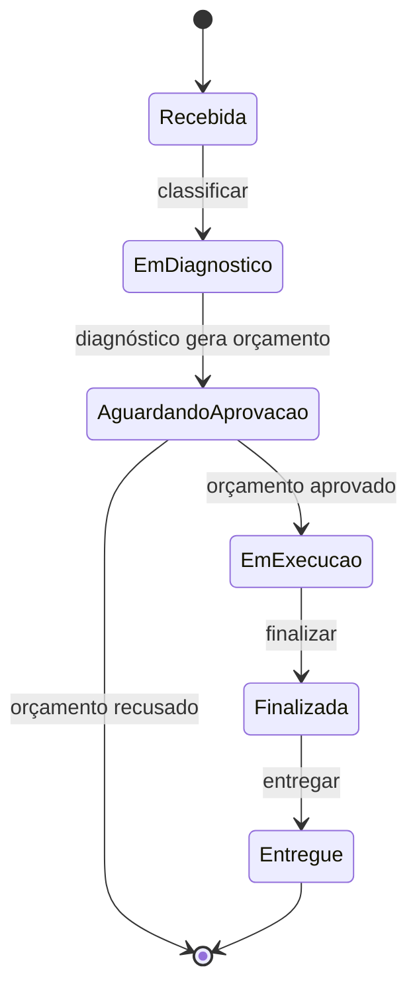
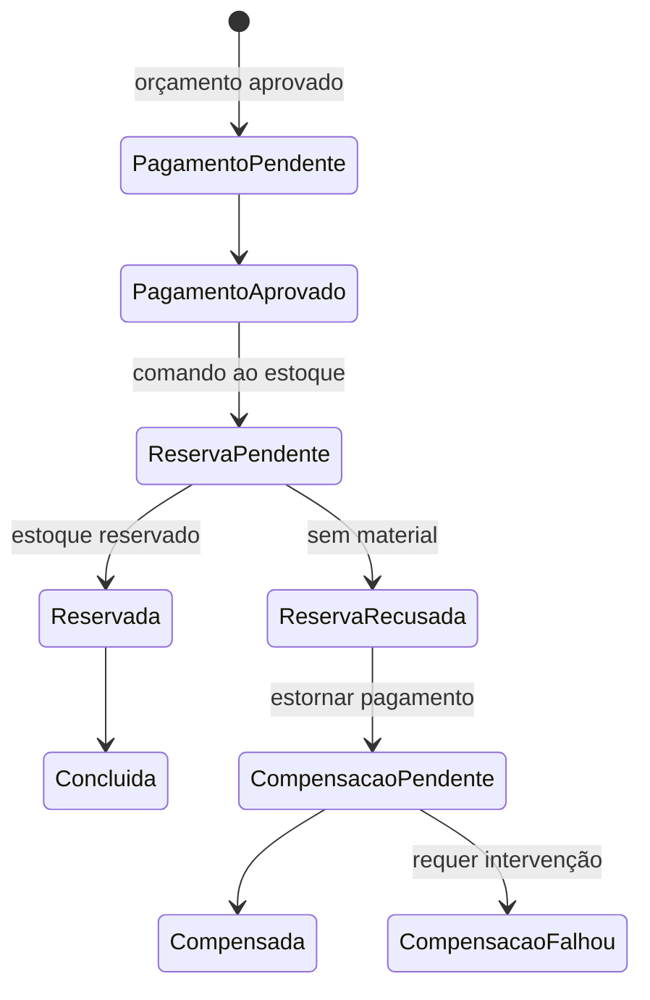
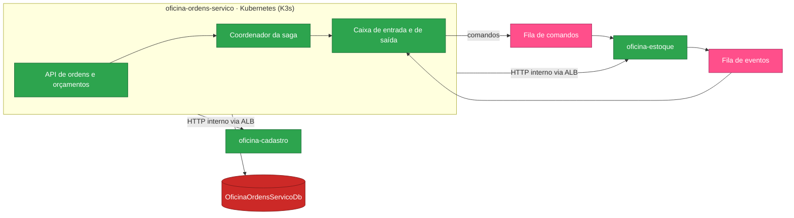

# oficina-ordens-servico


Microsserviço de **ordens de serviço, orçamento e saga de pagamento** da solução **Oficina**. É também o **hub de execução local** e o repositório da **collection Postman** que valida a solução publicada.


---

## Sumário

- [Visão geral](#visão-geral)
- [Ordem de deploy da solução](#ordem-de-deploy-da-solução)
- [Arquitetura](#arquitetura)
- [Autenticação](#autenticação)
- [Endpoints](#endpoints)
- [Pagamentos](#pagamentos)
- [O que consome e o que publica](#o-que-consome-e-o-que-publica)
- [Configuração](#configuração)
- [Como executar](#como-executar)
- [Validação](#validação)
- [Execução local](#execução-local)
- [Observabilidade](#observabilidade)
- [Limitações conhecidas](#limitações-conhecidas)
- [Próxima etapa](#próxima-etapa)

---

## Visão geral

A **Oficina** é uma plataforma de gestão de oficina mecânica implantada na AWS e distribuída em **6 repositórios** que compõem um único sistema. O cliente acessa uma **API Gateway HTTP**, que autentica na borda por uma **Lambda authorizer** e encaminha o tráfego, via **VPC Link**, para um **ALB interno** que roteia para três microsserviços **.NET 10 em Kubernetes (K3s single-node numa EC2 privada)**. Os serviços se comunicam por HTTP interno e por filas **SQS FIFO**, e persistem em um **RDS SQL Server** compartilhado.

| Repositório | Responsabilidade | Etapas |
|---|---|:---:|
| [oficina-infra-db](https://github.com/fabianorodrigues/oficina-infra-db-fiap-fase4) | Rede, banco de dados, segredos, estado do Terraform e admin inicial | 1, 3 e 6 |
| [oficina-infra](https://github.com/fabianorodrigues/oficina-infra-fiap-fase4) | Plataforma Kubernetes/ALB, entrada de API e observabilidade | 2, 9 e 10 |
| [oficina-auth-lambda](https://github.com/fabianorodrigues/oficina-auth-lambda-fiap-fase4) | Autenticação por CPF e validação de token | 4 |
| [oficina-cadastro](https://github.com/fabianorodrigues/oficina-cadastro-fiap-fase4) | Clientes, veículos, funcionários e catálogo de serviços | 5 |
| [oficina-estoque](https://github.com/fabianorodrigues/oficina-estoque-fiap-fase4) | Peças, insumos, saldos e reservas | 6 |
| **oficina-ordens-servico** *(este)* | Ordens de serviço, orçamento e saga de pagamento | 7 e 9 |

**Papel deste repositório:** orquestra o ciclo de vida da ordem de serviço e é o único serviço que coordena os demais — abertura, diagnóstico, orçamento, **saga distribuída** de pagamento e reserva de material, e relatórios.

---

## Ordem de deploy da solução

| # | Repositório | Workflow | Confirmação |
|:---:|---|---|:---:|
| 1 | oficina-infra-db | Database Infrastructure Deploy | `APPLY` |
| 2 | oficina-infra | Platform Deploy | `APPLY` |
| 3 | oficina-infra-db | Database Bootstrap (estrutura) | `BOOTSTRAP` |
| 4 | oficina-auth-lambda | Auth Deploy | `DEPLOY` |
| 5 | oficina-cadastro | Cadastro Deploy | `DEPLOY` |
| 6 | oficina-infra-db | Initial Admin Provision | `PROVISION_ADMIN` |
| 7 | oficina-estoque | Estoque Deploy | `DEPLOY` |
| **8** | **oficina-ordens-servico** | **Ordens Deploy** | `DEPLOY` |
| 9 | oficina-infra | Entrypoint Deploy | `APPLY` |
| 10 | oficina-infra | Observability Deploy | `DEPLOY` |
| **11** | **oficina-ordens-servico** | **Collection Postman** (execução manual) | — |

Após a etapa 9, execute o **Observability Deploy** (oficina-infra) com `mode=DEPLOY` antes da validação funcional final.

> [!IMPORTANT]
> Este repositório aparece duas vezes: na **etapa 8**, como o terceiro dos três serviços, e na **etapa 11**, que **encerra a sequência** com a validação funcional executada pelo Collection Runner do Postman a partir de [postman/](postman/). A etapa 11 exige o admin inicial criado pela etapa **6**. É também o **hub de execução local**: seu arquivo de composição sobe os três serviços, o banco e as filas emuladas.

---

## Arquitetura

O ciclo de vida da ordem de serviço:


```mermaid
stateDiagram-v2
    [*] --> Recebida
    Recebida --> EmDiagnostico: classificar
    EmDiagnostico --> AguardandoAprovacao: diagnóstico gera orçamento
    AguardandoAprovacao --> EmExecucao: orçamento aprovado
    AguardandoAprovacao --> [*]: orçamento recusado
    EmExecucao --> Finalizada: finalizar
    Finalizada --> Entregue: entregar
    Entregue --> [*]
```

A aprovação do orçamento dispara a **saga**, que trata pagamento e reserva de material como uma transação distribuída com compensação:


```mermaid
stateDiagram-v2
    [*] --> PagamentoPendente: orçamento aprovado
    PagamentoPendente --> PagamentoAprovado
    PagamentoAprovado --> ReservaPendente: comando ao estoque
    ReservaPendente --> Reservada: estoque reservado
    Reservada --> Concluida
    ReservaPendente --> ReservaRecusada: sem material
    ReservaRecusada --> CompensacaoPendente: estornar pagamento
    CompensacaoPendente --> Compensada
    CompensacaoPendente --> CompensacaoFalhou: requer intervenção
```

O serviço fala com os demais de duas formas — HTTP interno (via ALB) para consultas e SQS FIFO para a saga:


```mermaid
flowchart LR
    subgraph Ordens["oficina-ordens-servico · Kubernetes (K3s)"]
        direction TB
        API["API de ordens e orçamentos"]
        Saga["Coordenador da saga"]
        Msg["Caixa de entrada e de saída"]
        API --> Saga --> Msg
    end

    Ordens -->|"HTTP interno via ALB"| Cadastro["oficina-cadastro"]
    Ordens -->|"HTTP interno via ALB"| Estoque["oficina-estoque"]
    Msg -->|"comandos"| FC["Fila de comandos"]
    FE["Fila de eventos"] --> Msg
    FC --> Estoque
    Estoque --> FE
    Ordens --> DB[("OficinaOrdensServicoDb")]

    classDef svc fill:#2da44e,stroke:#166534,color:#fff
    classDef data fill:#CC2927,stroke:#7a1717,color:#fff
    classDef queue fill:#FF4F8B,stroke:#a11d55,color:#fff
    class API,Saga,Msg,Cadastro,Estoque svc
    class DB data
    class FC,FE queue
```

Clean Architecture com portas na camada de aplicação e adaptadores na infraestrutura: clientes HTTP tipados, mensageria e o processador de pagamento implementam interfaces definidas pelos casos de uso.

---

## Autenticação

O token é validado pelo autorizador da API Gateway, que devolve as *claims* à borda. A API Gateway as converte em cabeçalhos de identidade (`x-oficina-user-id`, `x-oficina-user-cpf`, `x-oficina-user-role`, `x-oficina-user-name`) e os injeta na requisição encaminhada. Apenas `/health`, `/ready` e as ações externas de orçamento por token são anônimas.

Dois pontos específicos deste serviço:

- **Propagação entre serviços.** As chamadas às rotas internas de cadastro e estoque repassam os cabeçalhos de identidade recebidos, de modo que o serviço chamado autoriza em nome do mesmo usuário.
- **Escopo do cliente.** As rotas de cliente derivam o solicitante da *claim* de identidade e verificam a propriedade do recurso. Ordem ou orçamento de outro cliente responde como inexistente.

Os cabeçalhos são confiáveis porque o ALB é interno e o acesso está restrito ao VPC Link. No perfil de desenvolvimento, um modo alternativo aceita cabeçalhos `X-Dev-*` — **ativado apenas em desenvolvimento**.

---

## Endpoints

| Método | Rota | Perfil |
|---|---|---|
| `POST` `GET` | `/api/ordens-servico` · `/{id}` · `/{id}/status` | Funcionário ou administrador |
| `POST` | `/api/ordens-servico/{id}/classificar` · `/diagnostico` · `/finalizar` · `/entregar` | Funcionário ou administrador |
| `GET` `POST` | `/api/orcamentos/{id}` · `/aprovar` · `/recusar` | Funcionário ou administrador |
| `GET` `POST` | `/api/meus-orcamentos/...` · `/api/minhas-ordens-servico/...` | Cliente |
| `GET` | `/api/orcamentos/acoes-externas/aprovar` · `/recusar` | Anônimo, por token de uso único |
| `GET` | `/api/relatorios/tempo-medio-execucao` | Funcionário ou administrador |
| `POST` | `/api/webhooks/payments` | **Desativado, responde não encontrado** |
| `GET` | `/health` · `/ready` | Anônimo |

As ações externas de orçamento permitem que o cliente aprove ou recuse por link, sem autenticar: o token é validado e distingue link inválido, expirado e ação já processada.

> [!NOTE]
> `/ready` **verifica a conexão com o banco** e responde `503` quando ela falha. É esse endpoint que o *target group* do ALB usa como health check, então o destino só fica saudável com o serviço pronto para atender. `/health` continua refletindo apenas o processo.

---

## Pagamentos

O provedor de pagamento é **um mock interno determinístico**, não uma integração externa:

- O resultado é decidido pelo cenário configurado, fixado em aprovação no ambiente publicado.
- A integração externa está **estruturalmente desativada**: a validação de inicialização interrompe a aplicação se alguém tentar habilitá-la, e o webhook responde não encontrado.
- O deploy confere os sinalizadores de pagamento e falha se qualquer um deles estiver ligado.

A saga, a idempotência e a compensação são reais e exercitadas; apenas o provedor é simulado.

---

## O que consome e o que publica

### Consome

| Valor | Origem | Criado por |
|---|---|---|
| Node do cluster e namespace | `/oficina/infra/k8s/instance-id` · `/oficina/infra/k8s/namespace` | oficina-infra |
| Registro de imagem, target group e NodePort | `/oficina/infra/ecr/ordens` · `/oficina/infra/services/ordens/{target-group-arn,node-port}` | oficina-infra |
| Filas de comandos e eventos + DLQs | `/oficina/infra/sqs/{estoque-comandos,ordens-eventos}[-dlq]/url` | oficina-infra |
| DNS do ALB interno | `/oficina/infra/alb/dns-name` | oficina-infra |
| Credenciais de runtime e migração | `/oficina/ordens/{runtime,migration}-db` | oficina-infra-db |

As integrações com cadastro e estoque apontam para o **DNS do ALB interno**; as credenciais são lidas do Secrets Manager **dentro da EC2** e materializadas como **Secrets Kubernetes**, um para o Deployment e outro para o Migration Job.

### Publica

O Deployment e o Service NodePort registrados no *target group* do ALB, os comandos de reserva nas filas e o esquema do banco de ordens, aplicado por um Migration Job nomeado com o commit SHA.

---

## Configuração

Configure em **Settings → Secrets and variables → Actions** do repositório.

| Tipo | Nome | Uso | Obrigatório |
|---|---|---|:---:|
| Secret | `AWS_ACCESS_KEY_ID` · `AWS_SECRET_ACCESS_KEY` · `AWS_SESSION_TOKEN` | Credenciais temporárias da AWS | **Sim** |
| Variable | `AWS_REGION` | Região dos recursos | **Sim** |
| Variable | `SONAR_PROJECT_KEY` · `SONAR_ORGANIZATION` | Projeto e organização no SonarCloud | Só com `SONAR_TOKEN` |
| Secret | `SONAR_TOKEN` | Token de análise do SonarCloud. Vazio ignora a análise; o gate local de cobertura continua valendo | Não |
| Variable | `TF_STATE_BUCKET` | Fallback do bucket que recebe o pacote de manifests | Não |

### Papéis IAM — não provisionados automaticamente

Nenhum workflow desta solução cria ou altera recursos IAM. O deploy não passa
role alguma: os Pods herdam a role do **instance profile da EC2 do cluster**,
configurada uma única vez em `oficina-infra` pela variável `INSTANCE_PROFILE_NAME`.

Essa role precisa permitir, no mínimo: registro no Systems Manager,
`ecr:GetAuthorizationToken` e pull das imagens, `secretsmanager:GetSecretValue`
nos segredos `/oficina/ordens/{runtime,migration}-db` e `ssm:GetParameter`
com `kms:Decrypt` em `/oficina/deploy/*`.

> [!NOTE]
> Sem IRSA e sem Pod Identity, todos os Pods do namespace compartilham essa role.
> O detalhe está registrado como risco em `docs/ARCHITECTURE.md`.
### Variáveis de ambiente da aplicação

Definidas pelo deploy no ConfigMap e nos Secrets do namespace; nenhuma precisa ser configurada no GitHub.

| Chave | Valor no ambiente publicado |
|---|---|
| `ConnectionStrings__DefaultConnection` | Materializada como Secret Kubernetes dentro da EC2, a partir do Secrets Manager |
| `Integrations__Cadastro__BaseUrl` · `Integrations__Estoque__BaseUrl` | DNS do ALB interno |
| `Messaging__Sqs__Enabled` · `DistributedFlow__Enabled` | **Ativados** |
| `Messaging__Sqs__*QueueUrl` | Os quatro endereços de fila |
| `Payments__UseMock` · `Payments__Mode` | **Mock** — integração externa desativada |
| `Database__ApplyMigrations` | Desativado — migrações rodam em Migration Job próprio |

---

## Como executar

### Etapa 7 — Ordens Deploy

**Actions → Ordens Deploy → Run workflow → `confirmation` = `DEPLOY`**

Roda apenas na branch `main`. Sequência: **BDD distribuído** → valida a requisição e a integração de pagamentos → SonarCloud begin (quando configurado) → compila → testa com cobertura → gate local de 80% → Quality Gate (quando configurado) → descobre registro de imagem, node, filas e DNS do ALB → constrói as imagens → varredura de vulnerabilidades → envia ao ECR → **Stage** do pacote de manifests → remove objeto S3 e SecureString → **Deploy** (imagens, ConfigMap, Secrets, Migration Job, Deployment, Service, rollout e capacidade) → confirma destino saudável no ALB.

### Etapa 11 — Collection Postman (execução manual)

**Postman → importar [postman/oficina-main-flow.postman_collection.json](postman/oficina-main-flow.postman_collection.json) e [postman/oficina-main-flow.postman_environment.json](postman/oficina-main-flow.postman_environment.json) → Collection Runner**

Executa o fluxo funcional contra o ambiente publicado, na ordem da collection: autentica o admin inicial, cria um funcionário, cadastra cliente e veículo, cadastra peça, ajusta estoque e cadastra serviço (com criação, alteração e consulta de cada um), abre uma ordem, classifica como corretiva, registra o diagnóstico, aprova o orçamento, repete a aprovação para provar a idempotência, acompanha a saga até a reserva de material, conclui e entrega a ordem, e fecha com o relatório e a manutenção do funcionário. É a validação final da solução.

Duas pré-condições obrigatórias:

1. **Etapa 9 concluída** — a API Gateway publica as rotas somente no Entrypoint Deploy.
2. **Etapa 10 concluída** — o Observability Deploy deve validar os sinais técnicos antes da execução funcional final.
3. **Administrador inicial provisionado** — execute o workflow **Initial Admin Provision** com `confirmation` = `PROVISION_ADMIN` em [oficina-infra-db](https://github.com/fabianorodrigues/oficina-infra-db-fiap-fase4#etapa-6-admin-inicial). Esse workflow exige que as migrations do Cadastro (etapa 5) já estejam aplicadas, por isso não pode rodar antes da etapa 5.

Antes de rodar, preencha três variáveis do environment (nenhuma é versionada):

| Variável | Origem |
|---|---|
| `baseUrl` | `aws ssm get-parameter --name /oficina/infra/api/url --query Parameter.Value --output text` |
| `loginCpf` | Secret `ADMIN_INICIAL_CPF` |
| `loginPassword` | Secret `ADMIN_INICIAL_PASSWORD` |

---

## Validação

### Pelo Console AWS

| Serviço | O que verificar |
|---|---|
| **ECR** | Repositório de ordens com a imagem do commit publicado |
| **EC2 → Instâncias** | Node do cluster `running` e `Online` no Systems Manager |
| **SQS** | Fila de eventos sendo consumida e **DLQs vazias** |

### Pela AWS CLI

<details>
<summary>Comandos de validação</summary>

```bash
REGIAO=<sua-regiao>
INSTANCIA=$(aws ssm get-parameter --name /oficina/infra/k8s/instance-id \
  --region "$REGIAO" --query 'Parameter.Value' --output text)

aws ssm describe-instance-information --filters "Key=InstanceIds,Values=$INSTANCIA" \
  --region "$REGIAO" --query 'InstanceInformationList[0].PingStatus' --output text

# Após a etapa 9, verificação de saúde pela API pública
API=$(aws ssm get-parameter --name /oficina/infra/api/url \
  --region "$REGIAO" --query 'Parameter.Value' --output text)
curl -s -o /dev/null -w '%{http_code}\n' "$API/health/ordens"
```

</details>

---

## Execução local

Este repositório orquestra o **ambiente local completo da solução**: banco SQL Server, filas FIFO emuladas, um serviço de pagamento simulado e os três microsserviços, construídos a partir dos diretórios vizinhos.

**Pré-requisitos:** Docker, e os repositórios [oficina-cadastro](https://github.com/fabianorodrigues/oficina-cadastro-fiap-fase4) e [oficina-estoque](https://github.com/fabianorodrigues/oficina-estoque-fiap-fase4) clonados **lado a lado** com este.

```
pasta-de-trabalho/
├── oficina-cadastro-fiap-fase4/
├── oficina-estoque-fiap-fase4/
└── oficina-ordens-servico-fiap-fase4/   <- execute daqui
```

```bash
# 1. Gera o arquivo de ambiente com senhas locais
pwsh ./scripts/setup-local-env.ps1

# 2. Sobe banco, filas, pagamento simulado e os três serviços
pwsh ./scripts/start-local.ps1

# 3. Confere que tudo subiu
pwsh ./scripts/status-local.ps1

# 4. Valida as rotas e o fluxo de mensagens
pwsh ./scripts/smoke-local.ps1
pwsh ./scripts/smoke-sqs-local.ps1

# 5. Exercita a saga de ponta a ponta
pwsh ./scripts/run-saga-smoke-test.ps1

# Logs e encerramento
pwsh ./scripts/logs-local.ps1
pwsh ./scripts/stop-local.ps1     # reset-local.ps1 apaga também os volumes
```

### Testes

```bash
dotnet restore
dotnet build -c Release
dotnet test
```

### Evidências de cobertura de testes

- Line coverage real: **85.18%** (655/769 linhas), medido em 25/07/2026 com `dotnet test Oficina.OrdensServico.sln --configuration Release --settings .runsettings --collect:"XPlat Code Coverage"`.
- CI: [Ordens CI](https://github.com/fabianorodrigues/oficina-ordens-servico-fiap-fase4/actions/workflows/ci.yml) executa o gate local de 80% e publica o artefato `coverage-${run_id}`.
- Configuração de cobertura: [`.runsettings`](.runsettings) e [`.github/workflows/ci.yml`](.github/workflows/ci.yml).

Os testes cobrem casos de uso, contratos públicos, metadados de persistência e a integração de pagamento com o provedor simulado. A suíte inteira roda na integração contínua.

---

## Observabilidade

Telemetria por OpenTelemetry, com um único Collector no cluster. Este é o serviço
que concentra as **métricas de negócio** da solução.

**Variáveis no ConfigMap:** `OTEL_EXPORTER_OTLP_ENDPOINT` (endpoint interno
obrigatório do Collector; o exporter é fail-open se o gateway ainda não
responder), `OTEL_SERVICE_VERSION` (commit SHA) e `OTEL_RESOURCE_ATTRIBUTES`. O `service.name` vem do código
(`oficina-ordens-servico`), sem `OTEL_SERVICE_NAME` duplicado no manifesto.
Nenhuma credencial da New Relic entra no Pod.

**Contrato dos logs**, com os campos no nível superior do JSON:

```
timestamp, level, message, service.name, service.version, deployment.environment,
correlationId, trace.id, span.id, ordemServicoId, messageId, messageType, sagaState
```

### Métricas de negócio

`Meter` `Oficina.OrdensServico`:

| Instrumento | Tipo | Dimensões |
|---|---|---|
| `oficina.os.created` | `Counter<long>` | — |
| `oficina.os.status.transitions` | `Counter<long>` | `from_status`, `to_status`, `result` |
| `oficina.os.status.duration` | `Histogram<double>` (s) | `status` |
| `oficina.os.processing.failures` | `Counter<long>` | `stage`, `reason` |
| `oficina.integration.failures` | `Counter<long>` | `integration`, `operation` |

`integration` vem de um conjunto fechado: `cadastro`, `estoque`, `sqs`, `database`,
`payment_mock`.

> [!IMPORTANT]
> São sinais operacionais **best-effort**. O banco e os `SagaSnapshots` continuam
> sendo a fonte oficial dos estados da saga.

As transições são acumuladas durante a transação e emitidas **somente depois do
commit**, o que evita contagem em rollback e em reprocessamento do Inbox. Isso não é
exactly-once: se o processo morrer entre o commit e o flush, a transação existe e a
métrica não.

`ordemServicoId` **nunca** entra como dimensão de métrica — só como atributo de span
e campo de log. A duração usa o instante da transição processada com
`max(0, transitionUtc - previousUpdatedAtUtc)`, e não o `OccurredAtUtc` da mensagem:
relógio externo ou mensagem antiga produziriam duração negativa.

`Recusado` no pagamento é resultado válido de negócio, não falha de integração, e por
isso não entra em `oficina.integration.failures`.

### Propagação de trace pelo SQS

Uma única fonte de span por etapa: o envelope carrega o contexto capturado na criação
do Outbox, o dispatcher abre um span `Internal` `oficina.outbox.dispatch`, a
instrumentação AWS cria o span real de envio e injeta a propagação nos
`MessageAttributes`, o receiver transfere esse contexto para o envelope persistido e o
Inbox Processor abre a **única** Activity `Consumer`. Não há injeção manual de
`traceparent`, que duplicaria o span de publicação.

O `PagamentoProcessor` ganhou uma Activity própria — sem ela o processamento rodava
sem contexto nenhum e as chamadas SQL ficavam órfãs no trace. O mock de pagamento
permanece **intocado**: continua retornando `Approved`, e nenhuma decisão, retry ou
compensação foi alterada.

**Fail-open.** Falha do Collector ou do New Relic registra erro local e o serviço
continua atendendo, consumindo mensagens e executando a saga.

Detalhes, queries do dashboard, alertas e troubleshooting em `docs/OBSERVABILITY.md`.

---

## Limitações conhecidas

- **Pagamento simulado.** Não há integração com provedor externo; o caminho externo é bloqueado por validação de inicialização.
- **Réplica única, sem escala automática**, por decisão de projeto.
- **Validação funcional manual.** A verificação de ponta a ponta do ambiente publicado é a collection Postman da etapa 11, executada à mão; não há workflow que a rode.
- **Compensação sem reprocessamento automático.** Uma saga que chega ao estado de falha de compensação exige intervenção manual.

---

## Próxima etapa

**Depois da etapa 8 (Ordens Deploy) → etapa 9, obrigatória.**
Pré-condição: Deployment `oficina-ordens-servico` disponível no cluster e destino saudável no *target group*, com os três serviços no ar.
**→ [oficina-infra](https://github.com/fabianorodrigues/oficina-infra-fiap-fase4)** — seção [Como executar → Entrypoint Deploy](https://github.com/fabianorodrigues/oficina-infra-fiap-fase4#entrypoint-deploy), que publica a API Gateway e o VPC Link.

**Depois da etapa 9 → etapa 10, obrigatória.**
Pré-condição: API Gateway aplicada e URL pública publicada em `/oficina/infra/api/url`.
**→ [oficina-infra](https://github.com/fabianorodrigues/oficina-infra-fiap-fase4)** — execute o **Observability Deploy** com `mode=DEPLOY` e `confirmation=DEPLOY`.

**Depois da etapa 10 → etapa 11, obrigatória, aqui mesmo.**
Pré-condição: observabilidade validada e administrador inicial provisionado.
**→ [Como executar → Etapa 11](#etapa-11--collection-postman-execução-manual)**, neste README. Encerra a sequência: com ela aprovada, a solução está publicada e validada.

Para revisar a etapa anterior, volte a **[oficina-estoque](https://github.com/fabianorodrigues/oficina-estoque-fiap-fase4)** (etapa 7).
