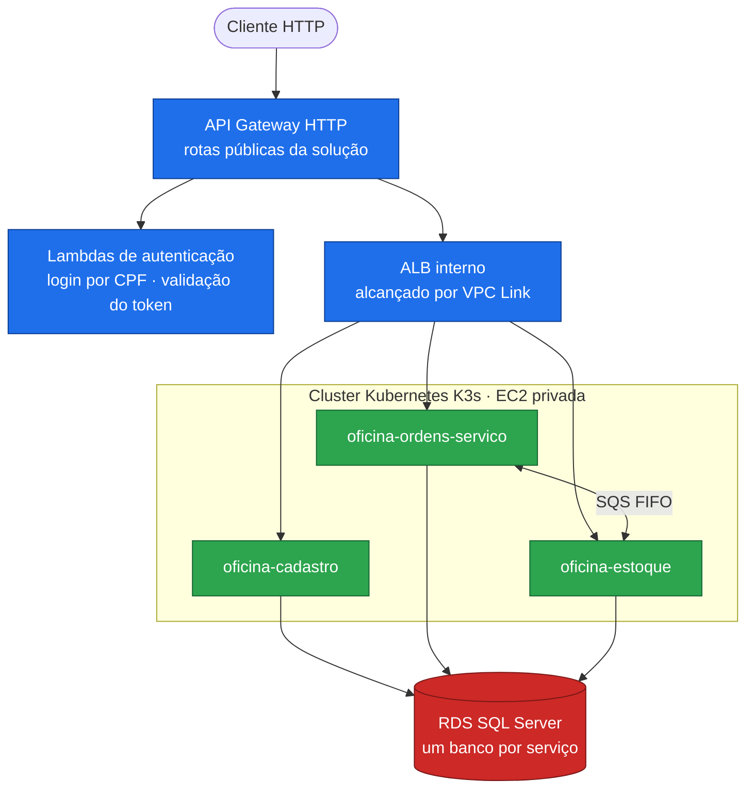
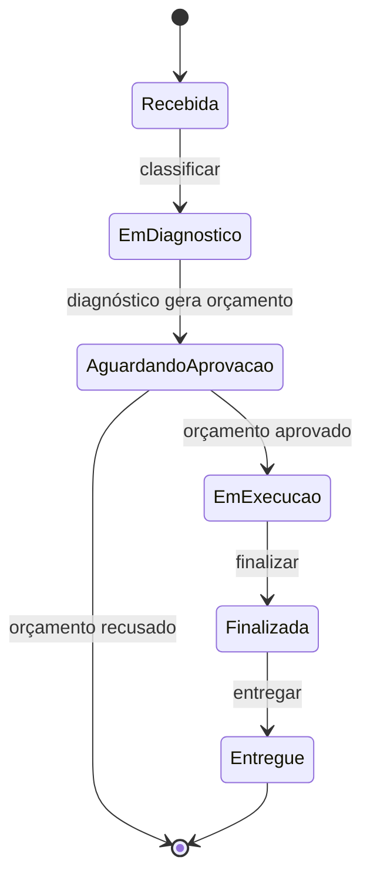
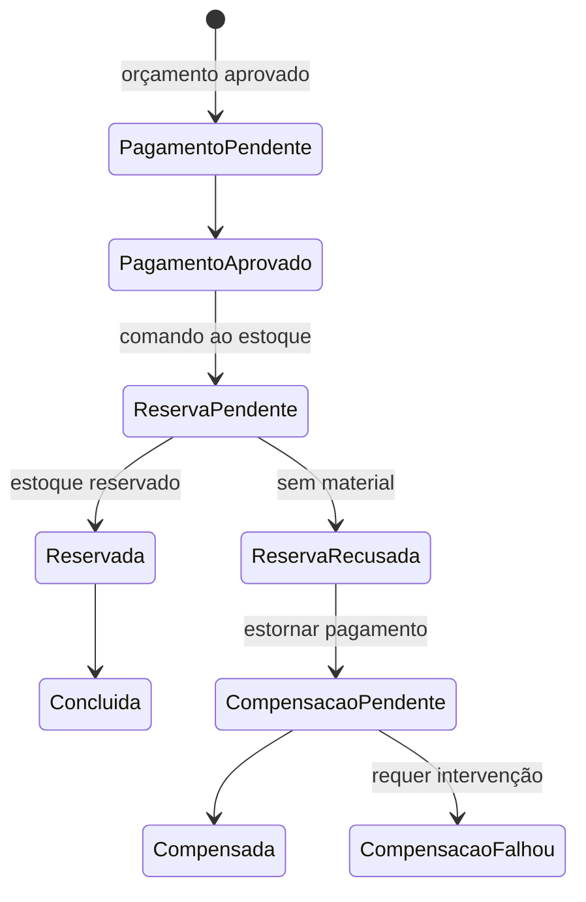
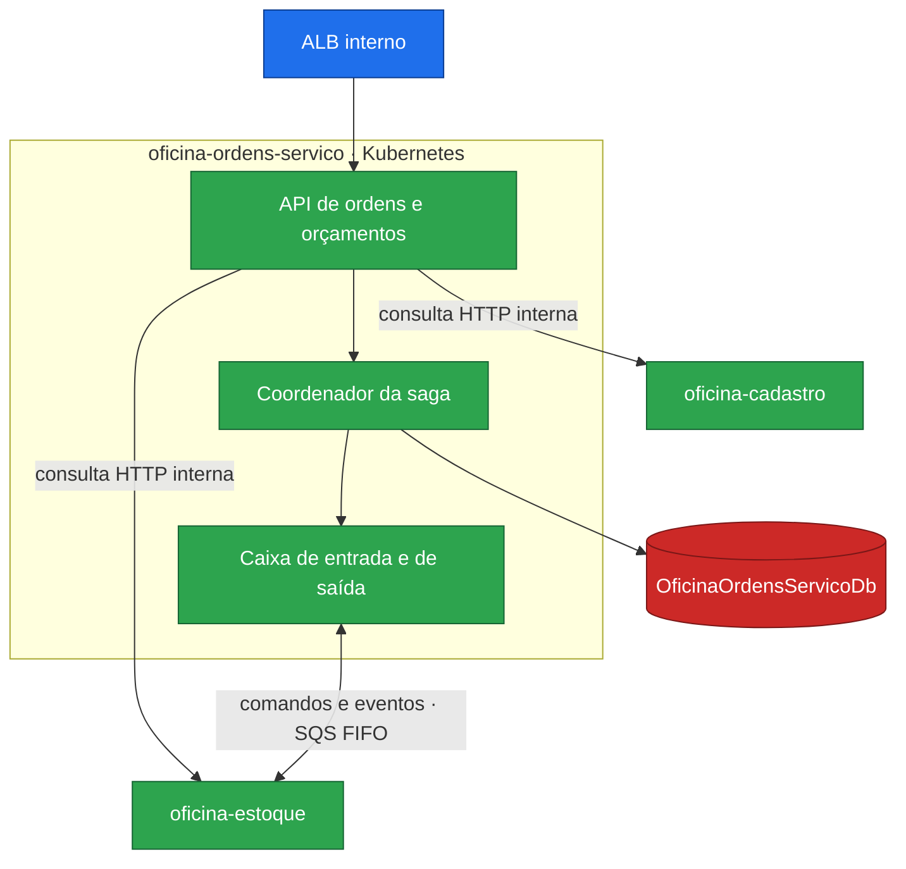

<h1 align="center">Oficina · Ordens de Serviço</h1>

<p align="center">
  Microsserviço de <strong>ordens de serviço, orçamento e saga de pagamento</strong> da solução
  <strong>Oficina</strong>. É também o hub do ambiente local e o repositório da collection Postman
  que valida a solução publicada.
</p>

<p align="center">
  
  
  
</p>

<p align="center">
  
  
  
  
  
  
  
</p>

---

## Sumário

- [Responsabilidade](#responsabilidade)
- [Solução integrada](#solução-integrada)
- [Ordem de deploy](#ordem-de-deploy)
- [Arquitetura](#arquitetura)
- [Endpoints](#endpoints)
- [Pré-requisitos manuais](#pré-requisitos-manuais)
- [Contratos consumidos e publicados](#contratos-consumidos-e-publicados)
- [Como configurar](#como-configurar)
- [Como executar](#como-executar)
- [Como validar](#como-validar)
- [Ambiente local](#ambiente-local)
- [Observabilidade](#observabilidade)
- [Próxima etapa](#próxima-etapa)

---

## Responsabilidade

Orquestra o ciclo de vida da ordem de serviço e é o único serviço que coordena os demais. Aparece **duas vezes** na sequência: publica o workload na etapa 8 e encerra a implantação com a validação funcional da etapa 11.

| Domínio | Conteúdo |
|---|---|
| Ordem de serviço | Abertura, classificação, diagnóstico, execução, finalização e entrega |
| Orçamento | Geração a partir do diagnóstico, aprovação e recusa, inclusive por link externo |
| Saga distribuída | Pagamento e reserva de material como transação distribuída com compensação |
| Relatórios | Tempo médio de execução |

### Pagamentos

O provedor de pagamento é um **mock interno determinístico**, não uma integração externa. A integração externa está estruturalmente desativada: a validação de inicialização interrompe a aplicação se alguém tentar habilitá-la, o webhook responde como não encontrado e o deploy confere os sinalizadores antes de publicar. A saga, a idempotência e a compensação são reais e exercitadas — apenas o provedor é simulado.

---

## Solução integrada

A **Oficina** é uma plataforma de gestão de oficina mecânica implantada na AWS e distribuída em **6 repositórios que formam um único sistema**. O cliente acessa uma **API Gateway HTTP**, autenticada na borda por **Lambdas**; o tráfego segue por **VPC Link** até um **ALB interno**, que roteia para três microsserviços **.NET 10** em **Kubernetes (K3s)**. Os serviços conversam por HTTP interno e por **filas SQS FIFO**, e persistem em um **RDS SQL Server** com um banco isolado por serviço.


```mermaid
flowchart TB
    Cliente([Cliente HTTP])
    Gateway["API Gateway HTTP<br/>rotas públicas da solução"]
    Auth["Lambdas de autenticação<br/>login por CPF · validação do token"]
    ALB["ALB interno<br/>alcançado por VPC Link"]

    subgraph Cluster["Cluster Kubernetes K3s · EC2 privada"]
        direction LR
        Cadastro["oficina-cadastro"]
        Ordens["oficina-ordens-servico"]
        Estoque["oficina-estoque"]
    end

    Banco[("RDS SQL Server<br/>um banco por serviço")]

    Cliente --> Gateway
    Gateway --> Auth
    Gateway --> ALB
    ALB --> Cadastro
    ALB --> Ordens
    ALB --> Estoque
    Ordens <-->|"SQS FIFO"| Estoque
    Cadastro --> Banco
    Ordens --> Banco
    Estoque --> Banco

    classDef borda fill:#1f6feb,stroke:#0b3d91,color:#fff
    classDef servico fill:#2da44e,stroke:#166534,color:#fff
    classDef dados fill:#CC2927,stroke:#7a1717,color:#fff
    class Gateway,Auth,ALB borda
    class Cadastro,Ordens,Estoque servico
    class Banco dados
```

| Repositório | Responsabilidade | Etapas |
|---|---|:---:|
| [oficina-infra-db](https://github.com/fabianorodrigues/oficina-infra-db-fiap-fase4) | Rede, banco de dados, segredos, estado do Terraform e administrador inicial | 1 · 3 · 6 |
| [oficina-infra](https://github.com/fabianorodrigues/oficina-infra-fiap-fase4) | Plataforma Kubernetes/ALB, entrada pública da API e observabilidade | 2 · 9 · 10 |
| [oficina-auth-lambda](https://github.com/fabianorodrigues/oficina-auth-lambda-fiap-fase4) | Autenticação por CPF e validação de token na borda | 4 |
| [oficina-cadastro](https://github.com/fabianorodrigues/oficina-cadastro-fiap-fase4) | Clientes, veículos, funcionários e catálogo de serviços | 5 |
| [oficina-estoque](https://github.com/fabianorodrigues/oficina-estoque-fiap-fase4) | Peças, insumos, saldos e reservas | 7 |
| **oficina-ordens-servico** *(este)* | Ordens de serviço, orçamento e saga de pagamento | 8 · 11 |

---

## Ordem de deploy

| # | Repositório | Workflow | Confirmação |
|:---:|---|---|:---:|
| 1 | oficina-infra-db | Database Infrastructure Deploy | `APPLY` |
| 2 | oficina-infra | Platform Deploy | `APPLY` |
| 3 | oficina-infra-db | Database Bootstrap | `BOOTSTRAP` |
| 4 | oficina-auth-lambda | Auth Deploy | `DEPLOY` |
| 5 | oficina-cadastro | Cadastro Deploy | `DEPLOY` |
| 6 | oficina-infra-db | Initial Admin Provision | `PROVISION_ADMIN` |
| 7 | oficina-estoque | Estoque Deploy | `DEPLOY` |
| **8** | **oficina-ordens-servico** *(este)* | **Ordens Deploy** | `DEPLOY` |
| 9 | oficina-infra | Entrypoint Deploy | `APPLY` |
| 10 | oficina-infra | Observability Deploy | `DEPLOY` |
| **11** | **oficina-ordens-servico** *(este)* | **Collection Postman** (manual) | — |

> [!IMPORTANT]
> A etapa 11 encerra a sequência e exige o administrador inicial criado na etapa 6, as rotas publicadas na etapa 9 e a observabilidade validada na etapa 10.

---

## Arquitetura

### Ciclo de vida da ordem de serviço


```mermaid
stateDiagram-v2
    direction TB
    [*] --> Recebida
    Recebida --> EmDiagnostico: classificar
    EmDiagnostico --> AguardandoAprovacao: diagnóstico gera orçamento
    AguardandoAprovacao --> EmExecucao: orçamento aprovado
    AguardandoAprovacao --> [*]: orçamento recusado
    EmExecucao --> Finalizada: finalizar
    Finalizada --> Entregue: entregar
    Entregue --> [*]
```

### Saga de pagamento e reserva

A aprovação do orçamento dispara a saga, que trata pagamento e reserva de material como uma transação distribuída com compensação.


```mermaid
stateDiagram-v2
    direction TB
    [*] --> PagamentoPendente: orçamento aprovado
    PagamentoPendente --> PagamentoAprovado
    PagamentoAprovado --> ReservaPendente: comando ao estoque
    ReservaPendente --> Reservada: estoque reservado
    Reservada --> Concluida
    ReservaPendente --> ReservaRecusada: sem material
    ReservaRecusada --> CompensacaoPendente: estornar pagamento
    CompensacaoPendente --> Compensada
    CompensacaoPendente --> CompensacaoFalhou: requer intervenção
```

### Integração com os demais serviços


```mermaid
flowchart TB
    ALB["ALB interno"]

    subgraph Servico["oficina-ordens-servico · Kubernetes"]
        direction TB
        API["API de ordens e orçamentos"]
        Saga["Coordenador da saga"]
        Mensageria["Caixa de entrada e de saída"]
        API --> Saga --> Mensageria
    end

    Cadastro["oficina-cadastro"]
    Estoque["oficina-estoque"]
    Banco[("OficinaOrdensServicoDb")]

    ALB --> API
    API -->|"consulta HTTP interna"| Cadastro
    API -->|"consulta HTTP interna"| Estoque
    Mensageria <-->|"comandos e eventos · SQS FIFO"| Estoque
    Saga --> Banco

    classDef borda fill:#1f6feb,stroke:#0b3d91,color:#fff
    classDef servico fill:#2da44e,stroke:#166534,color:#fff
    classDef dados fill:#CC2927,stroke:#7a1717,color:#fff
    class ALB borda
    class API,Saga,Mensageria,Cadastro,Estoque servico
    class Banco dados
```

Clean Architecture com portas na camada de aplicação e adaptadores na infraestrutura: clientes HTTP tipados, mensageria e o processador de pagamento implementam interfaces definidas pelos casos de uso.

### Autenticação

O token é validado pelo autorizador na borda, e a API Gateway injeta as *claims* como cabeçalhos de identidade. Apenas `/health`, `/ready` e as ações externas de orçamento por token são anônimas. Dois comportamentos são específicos deste serviço:

- **Propagação entre serviços.** As chamadas às rotas internas de cadastro e estoque repassam os cabeçalhos de identidade recebidos, de modo que o serviço chamado autoriza em nome do mesmo usuário.
- **Escopo do cliente.** As rotas de cliente derivam o solicitante da *claim* de identidade e verificam a propriedade do recurso; ordem ou orçamento de outro cliente responde como inexistente.

---

## Endpoints

| Método | Rota | Perfil |
|---|---|---|
| `GET` `POST` | `/api/ordens-servico` · `/{id}` · `/{id}/status` | Funcionário ou administrador |
| `POST` | `/api/ordens-servico/{id}/classificar` · `/diagnostico` · `/finalizar` · `/entregar` | Funcionário ou administrador |
| `GET` `POST` | `/api/orcamentos/{id}` · `/aprovar` · `/recusar` | Funcionário ou administrador |
| `GET` `POST` | `/api/meus-orcamentos/...` · `/api/minhas-ordens-servico/...` | Cliente |
| `GET` | `/api/orcamentos/acoes-externas/aprovar` · `/recusar` | Anônimo, por token de uso único |
| `GET` | `/api/relatorios/tempo-medio-execucao` | Funcionário ou administrador |
| `POST` | `/api/webhooks/payments` | Desativado — responde como não encontrado |
| `GET` | `/health` · `/ready` | Anônimo |

As ações externas permitem que o cliente aprove ou recuse o orçamento por link, sem autenticar: o token é validado e a resposta distingue link inválido, expirado e ação já processada.

`/health` reflete apenas o processo; `/ready` verifica a conexão com o banco e responde `503` quando ela falha. É esse endpoint que o target group do ALB usa como health check.

---

## Pré-requisitos manuais

| Pré-requisito | Onde configurar | Comportamento sem configuração |
|---|---|---|
| Credenciais temporárias da AWS | Secrets deste repositório | O workflow falha na autenticação |
| Região da AWS | Variable `AWS_REGION` | O workflow aborta na validação inicial |
| **Origem do BDD distribuído** | Variables `CADASTRO_REPOSITORY`, `CADASTRO_REF`, `ESTOQUE_REPOSITORY` e `ESTOQUE_REF` | O job de BDD falha antes do deploy: `Variavel <NOME> obrigatoria para o BDD distribuido` |
| Etapas 2 e 3 concluídas | [oficina-infra](https://github.com/fabianorodrigues/oficina-infra-fiap-fase4) e [oficina-infra-db](https://github.com/fabianorodrigues/oficina-infra-db-fiap-fase4) | O deploy falha ao resolver cluster, filas, registro de imagem ou credenciais |
| Instance profile da EC2 do cluster | Variable `INSTANCE_PROFILE_NAME`, em [oficina-infra](https://github.com/fabianorodrigues/oficina-infra-fiap-fase4#pré-requisitos-manuais) | Nenhum workflow da solução cria ou altera recursos IAM |
| Administrador inicial | Etapa 6, em [oficina-infra-db](https://github.com/fabianorodrigues/oficina-infra-db-fiap-fase4#etapa-6) | A validação funcional da etapa 11 não consegue autenticar |

**Nenhuma role é passada por este deploy.** Os Pods herdam a role do instance profile da EC2, que precisa permitir: registro no Systems Manager, `ecr:GetAuthorizationToken` e leitura das imagens, `secretsmanager:GetSecretValue` nos segredos `/oficina/ordens/{runtime,migration}-db`, `ssm:GetParameter` com `kms:Decrypt` no prefixo `/oficina/deploy/` e o consumo das filas da solução.

### BDD distribuído — obrigatório antes do deploy

O **Ordens Deploy** começa por um job de BDD que sobe os três serviços reais, o banco e filas FIFO emuladas em contêineres, e exercita o fluxo completo entre ordens e estoque. Cadastro e estoque são obtidos por checkout e construídos localmente, sem depender da AWS.

| Variable | Conteúdo | Regra |
|---|---|---|
| `CADASTRO_REPOSITORY` · `ESTOQUE_REPOSITORY` | Repositório no formato `owner/nome` | — |
| `CADASTRO_REF` · `ESTOQUE_REF` | **Commit SHA completo, de 40 caracteres** | Branch ou tag é recusada: referência móvel tornaria a execução irreproduzível |

Obtenha o SHA de cada repositório com:

```bash
git ls-remote https://github.com/<owner>/<repo>.git refs/heads/main
```

O Secret opcional `CROSS_REPOSITORY_TOKEN` só é necessário se esses repositórios forem privados; deve ser um token somente leitura restrito a eles. Com os repositórios públicos, o checkout é anônimo.

---

## Contratos consumidos e publicados

### Consome

| Valor | Caminho | Criado por |
|---|---|---|
| Node do cluster e namespace | `/oficina/infra/k8s/{instance-id,namespace}` | oficina-infra |
| Registro de imagem | `/oficina/infra/ecr/ordens` | oficina-infra |
| Target group e NodePort | `/oficina/infra/services/ordens/{target-group-arn,node-port}` | oficina-infra |
| Filas de comandos, eventos e DLQs | `/oficina/infra/sqs/{estoque-comandos,ordens-eventos}[-dlq]/url` | oficina-infra |
| Endereço interno do ALB | `/oficina/infra/alb/dns-name` | oficina-infra |
| Credenciais de runtime e migração | `/oficina/ordens/{runtime,migration}-db` | oficina-infra-db |
| URL pública da API | `/oficina/infra/api/url` | oficina-infra (etapa 9) |

As integrações com cadastro e estoque apontam para o endereço interno do ALB. As credenciais são lidas do Secrets Manager **dentro da EC2** e materializadas como **Secrets Kubernetes** distintos.

### Publica

Deployment e Service NodePort registrados no target group do ALB, os comandos de reserva nas filas e o esquema do banco de ordens, aplicado por um Migration Job identificado pelo commit.

---

## Como configurar

Configure em **Settings → Secrets and variables → Actions** deste repositório.

| Tipo | Nome | Uso | Obrigatório |
|---|---|---|:---:|
| Secret | `AWS_ACCESS_KEY_ID` · `AWS_SECRET_ACCESS_KEY` · `AWS_SESSION_TOKEN` | Credenciais temporárias da AWS | **Sim** |
| Variable | `AWS_REGION` | Região dos recursos | **Sim** |
| Variable | `CADASTRO_REPOSITORY` · `CADASTRO_REF` | Origem do cadastro no BDD distribuído | **Sim** |
| Variable | `ESTOQUE_REPOSITORY` · `ESTOQUE_REF` | Origem do estoque no BDD distribuído | **Sim** |
| Secret | `CROSS_REPOSITORY_TOKEN` | Leitura dos repositórios do BDD quando forem privados | Não |
| Secret | `SONAR_TOKEN` | Token de análise do SonarCloud | Não |
| Variable | `SONAR_PROJECT_KEY` · `SONAR_ORGANIZATION` | Projeto e organização no SonarCloud | **Sim, se `SONAR_TOKEN` existir** |
| Variable | `TF_STATE_BUCKET` | Bucket alternativo para o pacote de manifests | Não |

Sem `SONAR_TOKEN`, a análise de qualidade é ignorada e o **gate local de cobertura continua obrigatório**.

### Variáveis de ambiente da aplicação

Definidas pelo deploy no ConfigMap e nos Secrets do namespace. **Nenhuma precisa ser configurada no GitHub.**

| Chave | Valor no ambiente publicado |
|---|---|
| `ConnectionStrings__DefaultConnection` | Secret Kubernetes materializado dentro da EC2 |
| `Integrations__Cadastro__BaseUrl` · `Integrations__Estoque__BaseUrl` | Endereço interno do ALB |
| `Messaging__Sqs__Enabled` · `DistributedFlow__Enabled` | Ativados |
| `Messaging__Sqs__*QueueUrl` | Os quatro endereços de fila |
| `Payments__UseMock` · `Payments__Mode` | Mock — integração externa desativada |
| `Database__ApplyMigrations` | Desativado — as migrations rodam em Job próprio |
| `OTEL_EXPORTER_OTLP_ENDPOINT` · `OTEL_SERVICE_VERSION` · `OTEL_RESOURCE_ATTRIBUTES` | Endereço interno do Collector, commit e atributos de recurso |

---

## Como executar

### Etapa 8 — Ordens Deploy

**Actions → Ordens Deploy → Run workflow → `confirmation` = `DEPLOY`**

Roda apenas na branch `main`.

| Fase | O que acontece |
|---|---|
| BDD distribuído | Sobe os três serviços em contêineres e exercita o fluxo entre ordens e estoque; o deploy só continua se todos os cenários passarem |
| Qualidade | Valida o contrato de configuração e a desativação da integração externa de pagamento, compila, testa com cobertura, aplica o **gate local de 80%** e, quando configurado, o Quality Gate do SonarCloud |
| Imagens | Descobre registro, node, filas e endereço do ALB, constrói as imagens de runtime e de migração e as marca com o commit |
| Segurança | Varredura de vulnerabilidades que **interrompe o deploy** em achado alto ou crítico, antes do envio ao ECR |
| Publicação | Transporta o pacote de manifests, aplica ConfigMap, Secrets, Migration Job, Deployment e Service, acompanha o rollout e confere a capacidade do node |
| Confirmação | Verifica que o destino ficou saudável no target group |

A entrada opcional `transport` define como o pacote de manifests chega ao node: `s3` (padrão, por URL pré-assinada) ou `ssm`.

### Etapa 11 — Collection Postman

Validação funcional do ambiente publicado, executada manualmente. **Importe no Postman** a collection e o environment de [postman/](postman/) e rode pelo Collection Runner.

Pré-condições: etapas 9 e 10 concluídas e administrador inicial provisionado na etapa 6.

Preencha três variáveis do environment antes de executar — nenhuma delas é versionada:

| Variável | Origem |
|---|---|
| `baseUrl` | Parâmetro `/oficina/infra/api/url` no Parameter Store |
| `loginCpf` | Secret `ADMIN_INICIAL_CPF`, configurado em oficina-infra-db |
| `loginPassword` | Secret `ADMIN_INICIAL_PASSWORD`, configurado em oficina-infra-db |

```bash
aws ssm get-parameter --name /oficina/infra/api/url \
  --region <sua-regiao> --query 'Parameter.Value' --output text
```

A collection executa, nesta ordem: autenticação do administrador, criação de funcionário, cadastro de cliente e veículo, cadastro de peça, ajuste de estoque e cadastro de serviço — cada um com criação, alteração e consulta —, abertura de ordem, classificação, diagnóstico, aprovação do orçamento, repetição da aprovação para provar a idempotência, acompanhamento da saga até a reserva de material, conclusão e entrega da ordem, relatório e manutenção do funcionário.

Com a execução aprovada, a solução está publicada e validada.

---

## Como validar

### Pelo Console AWS

| Serviço | O que verificar |
|---|---|
| **ECR** | Repositório de ordens com a imagem do commit publicado |
| **EC2 → Instâncias** | Node do cluster `running` e `Online` no Systems Manager |
| **EC2 → Target Groups** | Destino das ordens saudável |
| **SQS** | Fila de eventos sendo consumida e **DLQs vazias** |

### Pela AWS CLI

<details>
<summary>Comandos de validação</summary>

```bash
REGIAO=<sua-regiao>

INSTANCIA=$(aws ssm get-parameter --name /oficina/infra/k8s/instance-id \
  --region "$REGIAO" --query 'Parameter.Value' --output text)
aws ssm describe-instance-information --filters "Key=InstanceIds,Values=$INSTANCIA" \
  --region "$REGIAO" --query 'InstanceInformationList[0].PingStatus' --output text

# Após a etapa 9, verificação de saúde pela API pública
API=$(aws ssm get-parameter --name /oficina/infra/api/url \
  --region "$REGIAO" --query 'Parameter.Value' --output text)
curl -s -o /dev/null -w '%{http_code}\n' "$API/health/ordens"
```

</details>

---

## Ambiente local

Este repositório orquestra o **ambiente local completo da solução**: banco SQL Server, filas FIFO emuladas, um serviço de pagamento simulado, um gateway local e os três microsserviços, construídos a partir dos diretórios vizinhos.

**Pré-requisitos:** Docker e PowerShell, com os repositórios de cadastro e estoque clonados **lado a lado** com este.

```
pasta-de-trabalho/
├── oficina-cadastro-fiap-fase4/
├── oficina-estoque-fiap-fase4/
└── oficina-ordens-servico-fiap-fase4/   <- execute daqui
```

```bash
# 1. Gera o arquivo de ambiente com senhas locais
pwsh ./scripts/setup-local-env.ps1

# 2. Sobe banco, filas, pagamento simulado, gateway e os três serviços
pwsh ./scripts/start-local.ps1

# 3. Confere que tudo subiu
pwsh ./scripts/status-local.ps1

# 4. Valida as rotas e o fluxo de mensagens
pwsh ./scripts/smoke-local.ps1
pwsh ./scripts/smoke-sqs-local.ps1

# 5. Exercita a saga de ponta a ponta
pwsh ./scripts/run-saga-smoke-test.ps1

# 6. Executa a collection Postman contra o ambiente local
pwsh ./scripts/run-postman-local.ps1

# Logs e encerramento
pwsh ./scripts/logs-local.ps1
pwsh ./scripts/stop-local.ps1     # reset-local.ps1 remove também os volumes
```

O arquivo de ambiente gerado contém senhas efêmeras válidas apenas dentro da composição local e não é versionado.

### Testes

```bash
dotnet restore
dotnet build -c Release
dotnet test
```

### Cobertura de testes

| Item | Valor |
|---|---|
| Cobertura de linhas | **85,18%** (655/769 linhas) |
| Gate exigido pela CI | 80% |
| Comando | `dotnet test Oficina.OrdensServico.sln --configuration Release --settings .runsettings --collect:"XPlat Code Coverage"` |
| Configuração | [`.runsettings`](.runsettings) e [`.github/workflows/ci.yml`](.github/workflows/ci.yml) |

A CI publica o relatório de cobertura e os artefatos do BDD como artefatos de execução. Os testes cobrem casos de uso, contratos públicos, metadados de persistência e a integração de pagamento com o provedor simulado.

---

## Observabilidade

Telemetria por OpenTelemetry, com um único Collector no cluster. Este é o serviço que concentra as **métricas de negócio** da solução.

Campos no nível superior de cada log:

```
timestamp, level, message, service.name, service.version, deployment.environment,
correlationId, trace.id, span.id, ordemServicoId, messageId, messageType, sagaState
```

### Métricas de negócio

| Instrumento | Tipo | Dimensões |
|---|---|---|
| `oficina.os.created` | Contador | — |
| `oficina.os.status.transitions` | Contador | `from_status`, `to_status`, `result` |
| `oficina.os.status.duration` | Histograma (s) | `status` |
| `oficina.os.processing.failures` | Contador | `stage`, `reason` |
| `oficina.integration.failures` | Contador | `integration`, `operation` |

As transições são acumuladas durante a transação e emitidas **somente após o commit**, o que evita contagem em rollback e em reprocessamento de mensagem. O identificador da ordem nunca entra como dimensão de métrica — apenas como atributo de span e campo de log. Um pagamento recusado é resultado válido de negócio e não conta como falha de integração.

> [!IMPORTANT]
> São sinais operacionais **best-effort**. O banco continua sendo a fonte oficial dos estados da saga.

**Propagação de trace pelo SQS.** O contexto é capturado na criação da caixa de saída e viaja no envelope da mensagem; a instrumentação da AWS cria o span de envio e injeta a propagação nos atributos da mensagem; o receptor transfere esse contexto para o envelope persistido; e o processador da caixa de entrada abre a única Activity de consumo.

**Fail-open:** falha do Collector ou da New Relic registra erro local e o serviço continua atendendo, consumindo mensagens e executando a saga.

Dashboard, alertas e monitores sintéticos são provisionados pela etapa 10, em [oficina-infra](https://github.com/fabianorodrigues/oficina-infra-fiap-fase4#observabilidade).

---

## Próxima etapa

**Depois da etapa 8 → etapa 9, obrigatória.**
Pré-condição: os três serviços no ar, com destinos saudáveis nos target groups.
**→ [oficina-infra](https://github.com/fabianorodrigues/oficina-infra-fiap-fase4#etapa-9--entrypoint-deploy)** — publica a API Gateway e o VPC Link.

**Depois da etapa 9 → etapa 10, obrigatória.**
Pré-condição: API Gateway aplicada e URL pública publicada.
**→ [oficina-infra](https://github.com/fabianorodrigues/oficina-infra-fiap-fase4#etapa-10--observability-deploy)** — provisiona e valida a observabilidade.

**Depois da etapa 10 → etapa 11, obrigatória, aqui mesmo.**
Pré-condição: sinais validados e administrador inicial provisionado.
**→ [Etapa 11 — Collection Postman](#etapa-11--collection-postman)**, que encerra a sequência.
